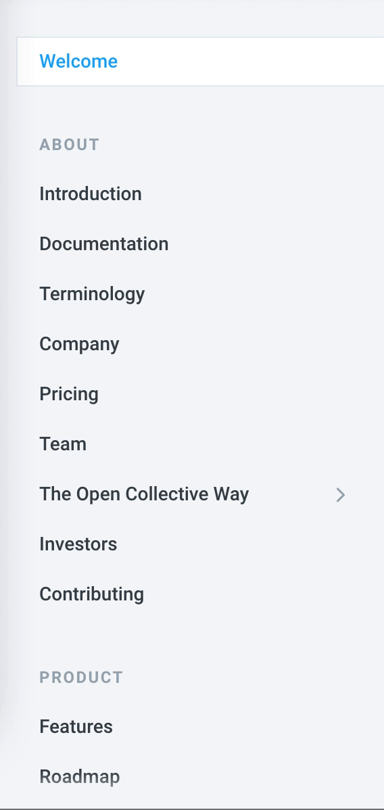

# Welcome

Open Collective is an online funding platform for open and transparent communities. We provide the tools to raise and share your finances in full transparency.

This is the place to find all help and documentation related to Open Collective. We are always open to suggested changes, so please feel free to give us feedback!

To suggest changes, click the GitHub icon on any docs page and make a pull request. If you're not sure how to do that, read our [step-by-step guide](contributing/documentation/suggesting-changes.md).

If you can't find the answer you're looking for, contact us at [support@opencollective.com](mailto:support@opencollective.com) or on our [Slack](https://slack.opencollective.com).

## Find your way to the right page

### Using our search bar

Use the search bar on the top right to search for specific words or phrases:

### Browsing sections

Use the menu bar on the lefthand side of the screen to browse the various pages.

