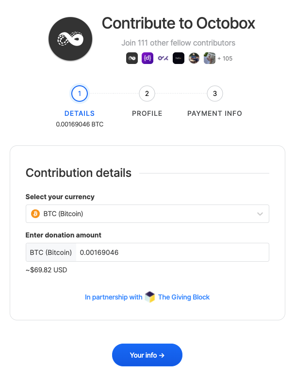
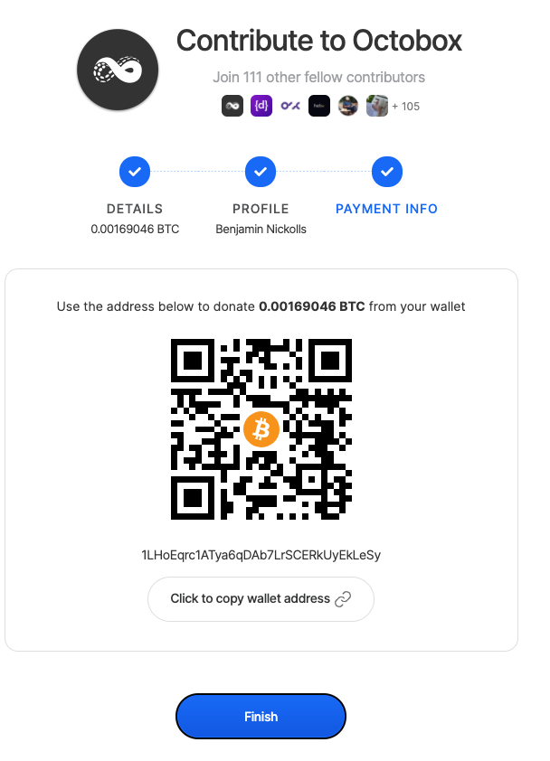

# Contributing Cryptocurrencies

Open Collective is currently trialling cryptocurrency use on the platform. 

A limited number of Collectives are now able to accept contributions using a range of cryptocurrencies including \(but not limited to\): 

* BitCoin \(BTC\)
* Ethereum \(ETH\)
* DAI \(DAI\)
* BitCoin Cash \(BCH\)
* LiteCoin\(LTE\)
* ZCash \(ZEC\)


**Contributions using cryptocurrency will be immediately converted into a fiat currency donation on receipt of your contribution.**


Contributing crypto' works a little differently from our normal process:

1. If a Collective is accepting contributions in cryptocurrencies you will see a 'Crypto Contribution' tier in the 'Contribute' section on their profile page. 
2. Click 'Contribute' to begin the flow
3. Select the currency you wish to contribute in and the amount you wish to contribute:

4. We calculate the anticipated contribution amount in the fiat currency used by the host.

5. Click 'your info' and select a profile to use for this contribution \(user, organization, or incognito\).


 Note that most cryptocurrencies are **not** private, using an incognito profile to contribute cryptocurrency to a Collective may reveal your identity. 


6. At this point we will generate an individual wallet address to collect your contribution. We will also email this wallet address to your registered email address. This wallet address is generated by our partner The Giving Block who use the Gemini exchange to provide their service:

7. Transfer the amount shown to the wallet address using your chosen wallet provider. 

### Conversion into fiat currency

On receipt of your contribution, we will convert your cryptocurrency into the fiat currency of the Collective and credit that amount \(minus processing fees and charges\) to the Collective. 

You will receive an email confirming that your contribution has been received and that it has been converted. 

Read the announcement

