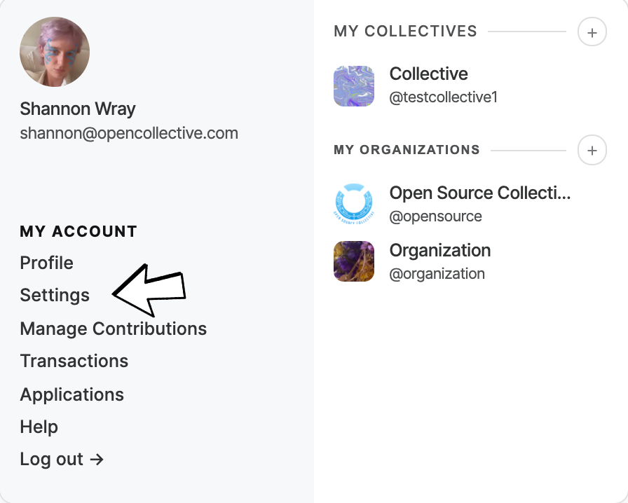
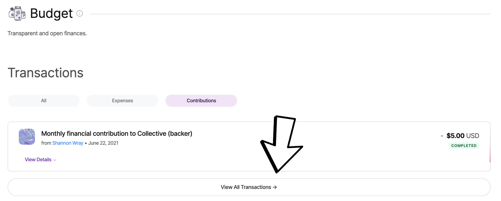
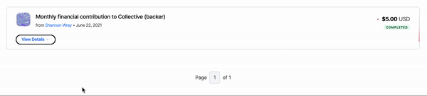
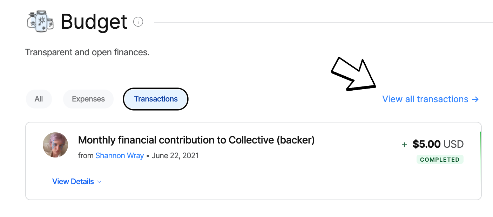
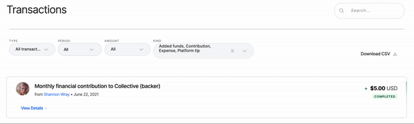
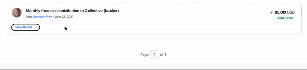
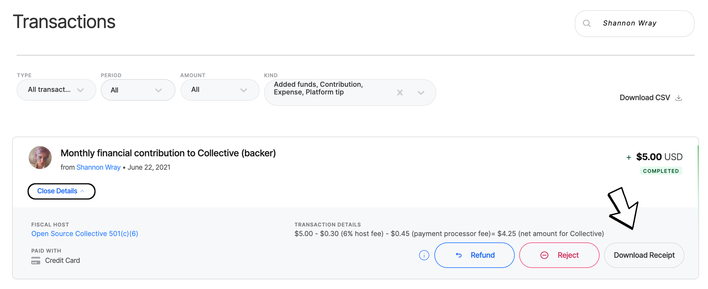

# Receipts

You should have received a receipt by email from Open Collective at the time of your donation. However, if that is not available to you, here are instructions on how you can generate a receipt for tax purposes.

**Instructions for Accessing Receipts via Settings** 

1. Ensure you are [signed in](https://opencollective.com/signin?next=%2F) with the email address you used to process the transaction.
2. Click on your name in the top right-hand corner. 
3. Under **My Account** click on Settings. 

4. Click on Payment Receipts, you should then be able to see all of your contributions 

**Instructions for Accessing Receipts via Profile** 

1. Ensure you are [signed in](https://opencollective.com/signin?next=%2F) with the email address you used to process the transaction.
2. Click on your name in the top right-hand corner. 
3. Under **My Account** click on **Profile**. 

4.  Scroll down to 'Budget and click 'Contributions'

5. Click 'View All Transactions'. 

6. Use the Search Function to find a specific transaction.

7. Use the Download Receipts to download all receipts from a specific time period.

8. If only one Receipt is needed once you've found the correct Transaction Click 'View Details'

9. Click 'Download Receipt in the bottom right-hand corner. 

**Instructions for Downloading a Tax Receipt from the Collectives page**  

1. Ensure you are [signed in](https://opencollective.com/signin?next=%2F) with the email address you used to process the transaction.
2. Go to the collectives page you supported
3. Scroll down to 'Budget and click 'Transactions'
4. Click on 'View All Transactions'.

5. On the right, in the 'Search' window next to 'Transacations' type in your name.

6. Find your contribution\(s\) and click on 'View Details'. 

7. Click 'Download Receipt' and you will download a PDF of your receipt that can be used for tax purposes. 

