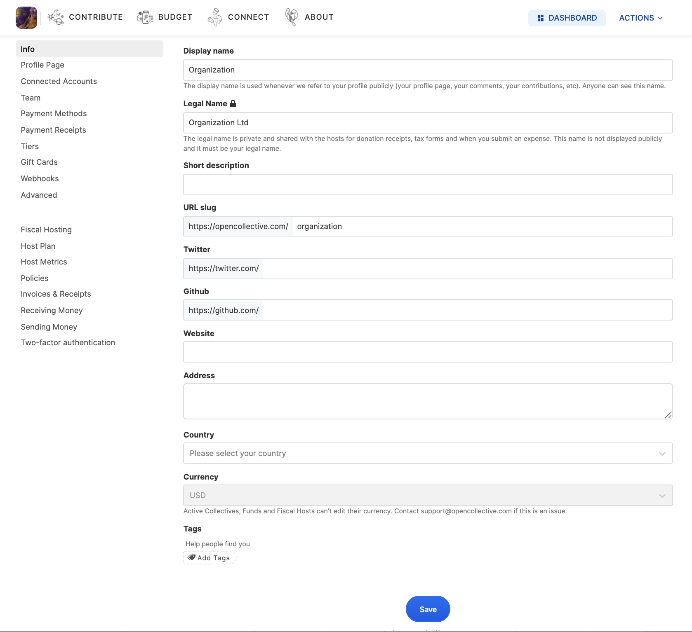

# Add more info

In this section of your settings, you can:

* Edit your Fiscal Host Display Name - The display name is used whenever we refer to your profile publicly \(your profile page, your comments, your contributions, etc\). Anyone can see this name.
* Edit your Legal Name - The legal name is private and shared with the hosts for donation receipts, tax forms and when you submit an expense. This name is not displayed publicly and it must be your legal name.
* Add a short description about your Fiscal Host
* Control your URL slug
* Add links to your Twitter and GitHub profiles
* Add your website
* Specify your address and country
* Choose your currency - Active Collectives, Funds and Fiscal Hosts can't edit their currency. Contact support@opencollective.com if this is an issue.
* Add tags to make your Fiscal Host more discoverable

