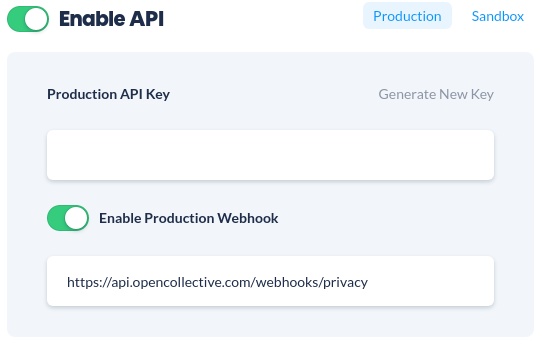
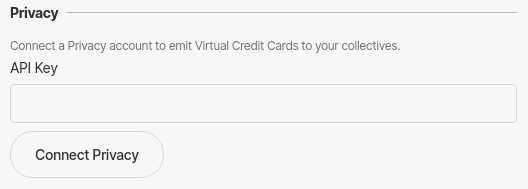

# Virtual Card Settings


**This feature is currently in closed Beta test.**


Virtual cards can be offered to collectives through Hosts. Hosts create virtual cards using our provider [Privacy.com](https://privacy.com/) and assign them to a Collective. Anyone with access to that card can then use it to make payments on behalf of the Collective. When a payment is made an expense is automatically created for the Collective and the owner is notified to attach a receipt. Virtual Cards are particularly useful for recurring payments like hosting a website.

## Connecting to Privacy

* Get the API Key from your Privacy.com account:
  * Open a new tab and go to your [Privacy account settings](https://privacy.com/account).
  * Click on "Enable API".
  * Select "Production" environment.
  * Enable Production Webhook and set the address to: `https://api.opencollective.com/webhooks/privacy`
  * Copy your Production API Key for the next step.

* Add your API key to your Collective settings:
  * Open your Collective settings and open the "Sending Money" page.
  * Paste your API Key in the "API Key" field and click on "Connect Privacy".

## Accessing Virtual Card Settings

To access your virtual card settings and policy select 'Virtual Cards' from your host profile settings page:

## Setting a policy

Hosts have complete control over when, how and to who they provide Virtual Cards. Hosts can define their own policy in the 'Virtual Card Policy Information' area.

## Enabling users to request virtual cards

It is possible to create and assign virtual cards to Collectives without enabling users to request them. 

Toggle the 'allow collectives to request a card' option to allow Collectives to request a card. Collectives can request a Virtual Card by clicking 'Request a card' from their profile page:

## Creating and assigning cards

Virtual Cards are created using our provider [Privacy.com](https://privacy.com/). To create a card on [Privacy.com](https://privacy.com/) register and follow the details [here](https://privacy.com/virtual-card).

Once you have created a card on [Privacy.com](https://privacy.com/) you can assign it to a Collective:

Select a Collective then select a user who is responsible for this card. This user will be automatically added to expenses created when a purchase is made using this card and they will be notified and asked to provide a receipt.

Click 'Save Card' to save the card to the Collective.

## Viewing Card details

You can view all cards assigned to Collectives from the Virtual Cards settings page. Here you can filter cards by status, merchant, and Collective.

Each card shows the name, status, assigned collective, when the card was assigned and any limits set on the card in Privacy.com. The last four digits of the card are also shown. To view the full details of a card click 'view card details'.


Be aware of your surroundings when viewing a card's details as others may be able to see them.


## Changing virtual card spending limits, owners and collectives

Virtual Card spending limits can be modified using Privacy.com. We do not provide facilities for moving cards between Users or Collectives. This ensures that we have clear records for Collectives with clear responsibilities. If you need to re-assign a card, delete the card then create and assign a new one instead.

If you need to make a change to initiative's card, please update to the correct amount in Privacy.com, and then contact us at [support@opencollective.com](mailto:support@opencollective.com) with a screenshot so that our team can make the adjustment on the platform.

## Pausing, resuming, and deleting a card

Pausing, resuming, and deleting should be done through Privacy's dashboard. Don't worry about syncing the information to the platform, our work will take care of updating the card state or deleting the cards that were removed from your Privacy account every hour.

