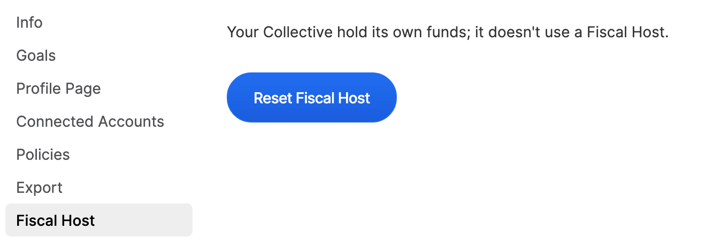

# Close an Independent Collective

If you wish to close down your Independent Collective or change to a different Fiscal Host, here are the steps to take.

1. Zero the balance of the Collective, by submitting real expenses or an expense for this purpose.
2. Go to Settings &gt; Fiscal Host &gt; Reset Fiscal Host
3. From here you can either keep your Collective and [apply to a new Fiscal Host](../collectives/add-fiscal-host.md), or proceed to [close down your Collective](../collectives/collective-settings/closing-a-collective.md).

