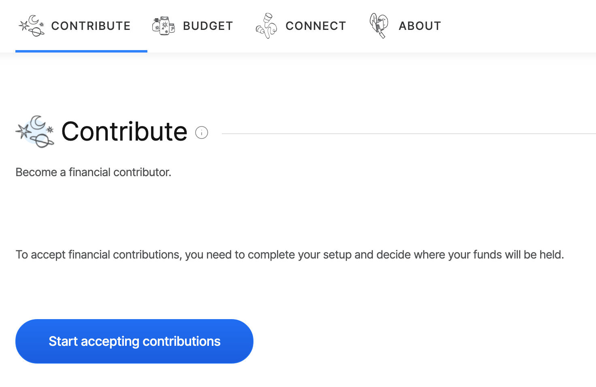
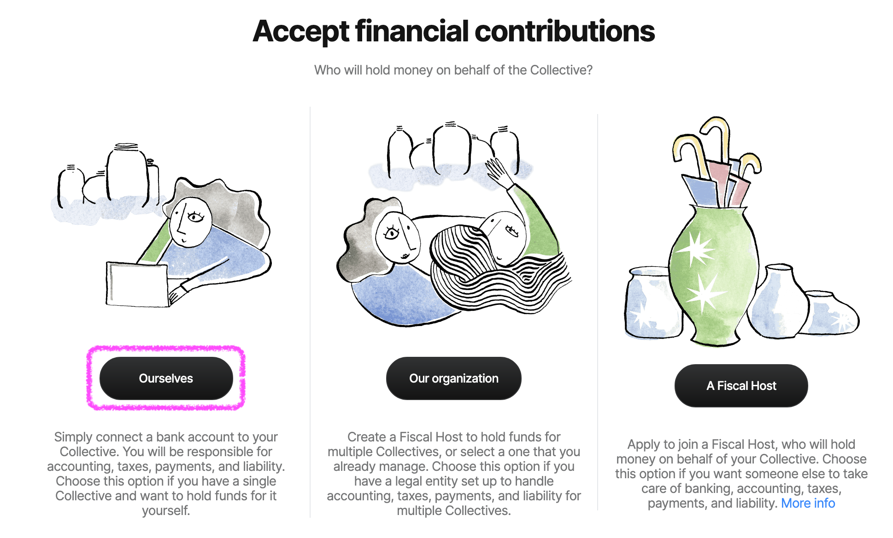
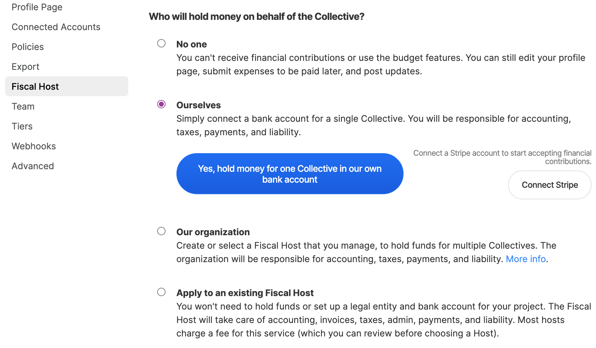

# Create Independent Collective

## Create an Independent Collective

[Create a Collective](../collectives/create-collective.md), selecting the "For any community" option.

Once your page is created, click "Start Accepting Contributions".

Then select "Ourselves".

Or, an alternative way is to go to Settings &gt; Fiscal Host. Here you can select "Ourselves" and then click "Yes hold money for one Collective in our own bank account".

