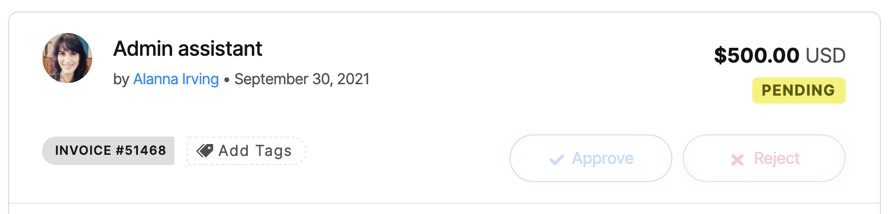

# Manage Independent Collective

## Managing an Independent Collective

There are some workflows you need to be familiar with to enable the smooth ongoing running of your independent Collective.

### Money coming in: Contributions

**Via Stripe**

If you have connected your Stripe account and someone contributed to your Collective using a credit card, the process is automated. The money will flow through to your bank account via Stripe, and the amount will automatically be credited to the balance of your Collective.

**Via bank transfer**

The bank transfer process is semi-manual. The payer selects 'bank transfer' at checkout and is automatically provided the instructions you specified in your receiving money settings, along with a unique ID code. They proceed to make the payment, using the code as a reference.

This transaction shows up in the 'pending bank transfers' section of your settings. It shows the amount, the contributor, and the unique ID code \(order\#\).

When the money shows up in your bank account, find the matching transaction under 'Pending bank transfers' and click 'Mark as completed. Once you do, the money will be credited to your Collective balance and the payer will automatically receive a receipt by email.

If a pending transfer is cancelled, click "Mark as expired" to remove it from this list. Otherwise it can just sit here and nothing will happen one way or the other.

#### Manually Add Funds

To represent money that has arrived for the project outside the Open Collective platform in your Collective's budget, use the 'Add Funds' option available in the Actions menu on the Collective page.

To specify the source of the funds, search for and select an existing Open Collective profile, or create a new individual or organization profile.

Then set the amount and click 'Add Funds'.

Since Independent Collectives use the platform for free, there is an optional platform tip when adding funds. If you feel the platform is adding value for you, select a tip amount \(this will be paid via Settlement Expenses\).

### Money going out: Expenses

When you want to spend money from your Collective balance, the payee needs to [submit an expense](../expenses-and-getting-paid/submitting-expenses.md). 

To see all expenses for your Collective, click that menu item under 'Budget'. 

Once submitted, the expense is **pending**. You or another admin of your Collective have the power to approve or reject expenses. Expenses must be approved by an admin before payment.

Click on each one to see details about what it's for, who submitted it, associated receipts, etc. It's up to you to set the requirements for expenses to be approved, e.g. it must have a valid receipt attached.

Once approved, the expense can be paid.

