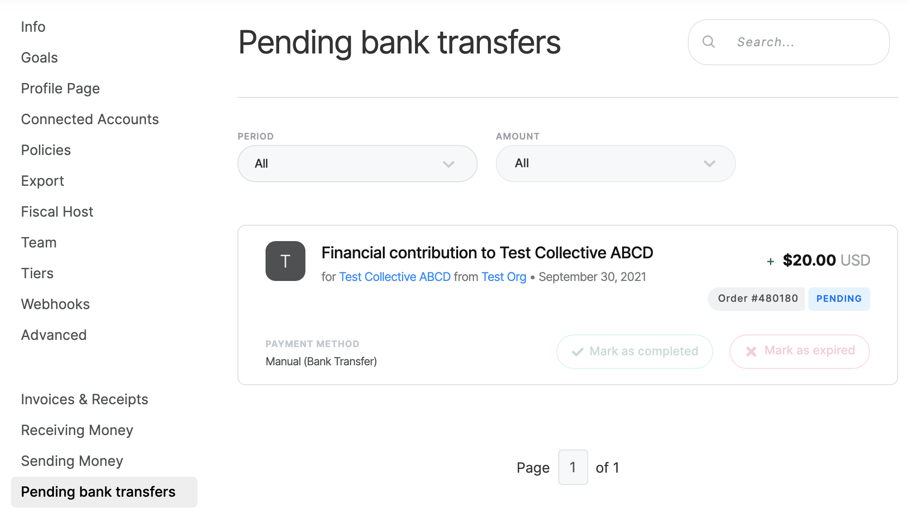
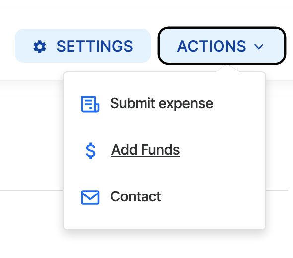
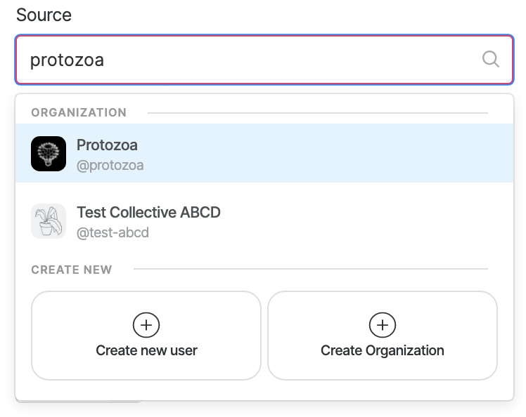
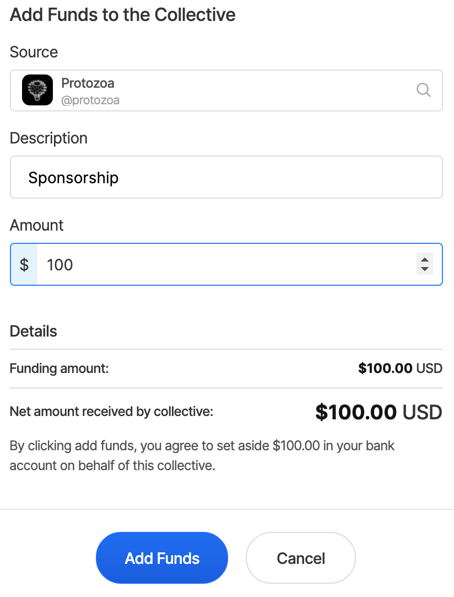

# Money coming in: Contributions

### **Via Stripe**

If you have connected your Stripe account and someone contributed to your Collective using a credit card, the process is automated. The money will flow through to your bank account via Stripe, and the amount will automatically be credited to the balance of your Collective.

### **Via bank transfer**

The bank transfer process is semi-manual. The payer selects 'bank transfer' at checkout and is automatically provided the instructions you specified in your receiving money settings, along with a unique ID code. They proceed to make the payment, using the code as a reference.

This transaction shows up in the 'pending bank transfers' section of your settings. It shows the amount, the contributor, and the unique ID code (order#).

When the money shows up in your bank account, find the matching transaction under 'Pending bank transfers' and click 'Mark as completed. Once you do, the money will be credited to your Collective balance and the payer will automatically receive a receipt by email.

If a pending transfer is cancelled, click "Mark as expired" to remove it from this list. Otherwise it can just sit here and nothing will happen one way or the other.

### Via any other means

To represent money that has arrived for the project outside the Open Collective platform in your Collective's budget, use the 'Add Funds' option available in the Actions menu on the Collective page.

To specify the source of the funds, search for and select an existing Open Collective profile, or create a new individual or organization profile.


If you select the Collective itself as the source, it will credit your budget without doing a corresponding debit—this is a good way to add historical transactions or easily add funds without needing to set up a profile for their source.


Then set the amount and click 'Add Funds'.

Since Independent Collectives use the platform for free, there is an optional platform tip when adding funds manually. If you feel the platform is adding value, select a tip amount (the payment will happen later via [Platform Settlement Expenses](money-going-out-expenses.md#platform-settlement-expenses)).

