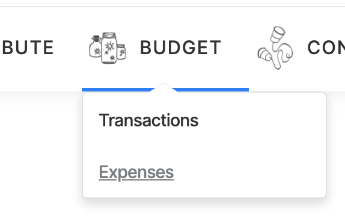
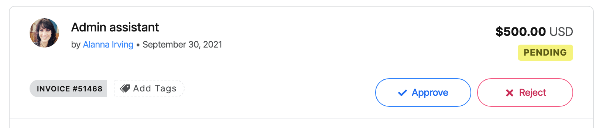
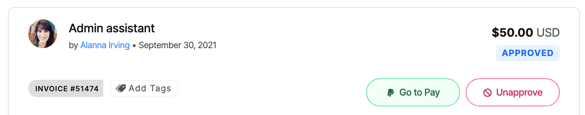
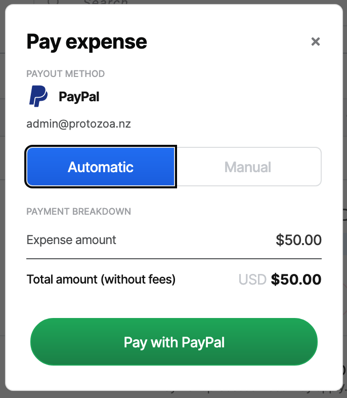
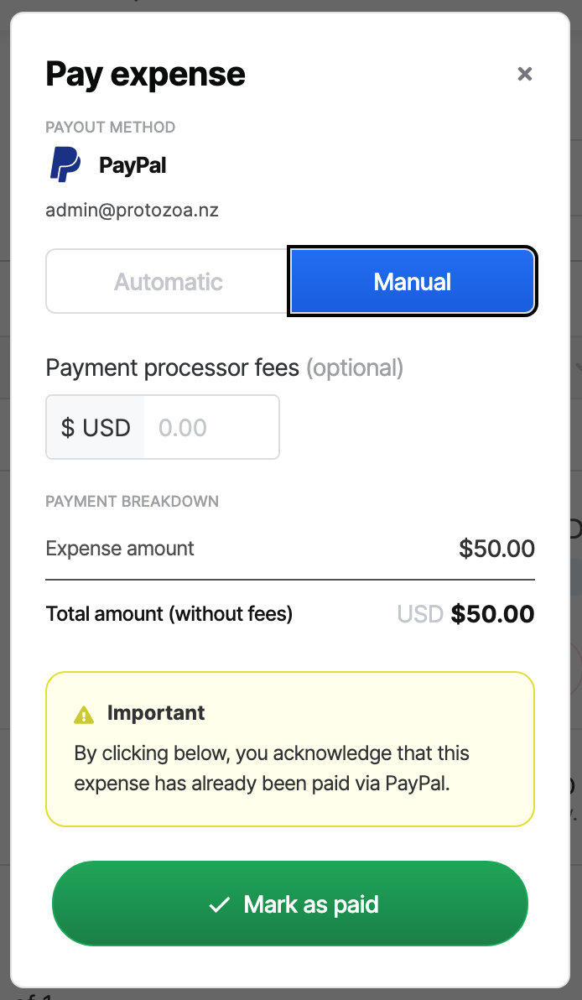
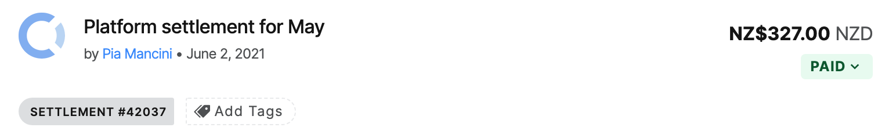

# Money going out: Expenses

To spend money from your Collective balance, the payee needs to [submit an expense](../../expenses-and-getting-paid/submitting-expenses.md).&#x20;

To see all expenses for your Collective, click 'Expenses' under the 'Budget' menu.&#x20;

## Approving Expenses

Once submitted, the expense will be pending. You (or another admin of your Collective) have the power to approve or reject expenses. Expenses must be approved by an admin before payment.

Click on the expense to see details about what it's for, who submitted it, associated receipts, etc. It's up to you to set the requirements for expenses to be approved.

## Paying Expenses

Once approved, you can click "Go to Pay".

The payment options depend on what payout method the payee has selected and whether or not you have connected your Wise and/or PayPal accounts in the 'Sending Money' section of your settings.

If you have connected Wise and/or PayPal, you can pay with one click through those payment processors.

If you have not connected these accounts through Open Collective, or simply wish to process them manually, select the manual option (if you haven't connected any payment processors manual will be the only option).

You can add any payment processor fees here, and they will be debited from the Collective balance along with the principle payment amount.

## Historical Expenses

If you wish to represent expenses previously paid but don't need to actually move any money or show the payee for each expense, you can select the Collective itself as the payee. This will debit the amount from the balance and record the details of the expense.

## Platform Settlement Expenses

A special type of expense is created when you owe Open Collective money from platform tips. Platform tips are an optional amount added on top of contributions and added funds.&#x20;

When a payment with a tip goes through Stripe, the tip is automatically diverted to Open Collective and you don't need to do anything.&#x20;

If a tip is made with a bank transfer transaction, the money—including the tip—will arrive in your bank account. Similarly, if you give a tip when [adding funds manually](money-coming-in-contributions.md#add-funds-manually), it represents money sitting in your bank account already. Therefore, Open Collective has to submit an expense to get paid.

Platform Settlement Expenses will automatically appear once per month if any tips are due to be transferred to Open Collective. You can proceed to approve and pay it like any other expense.

