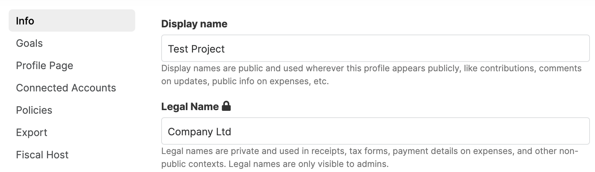
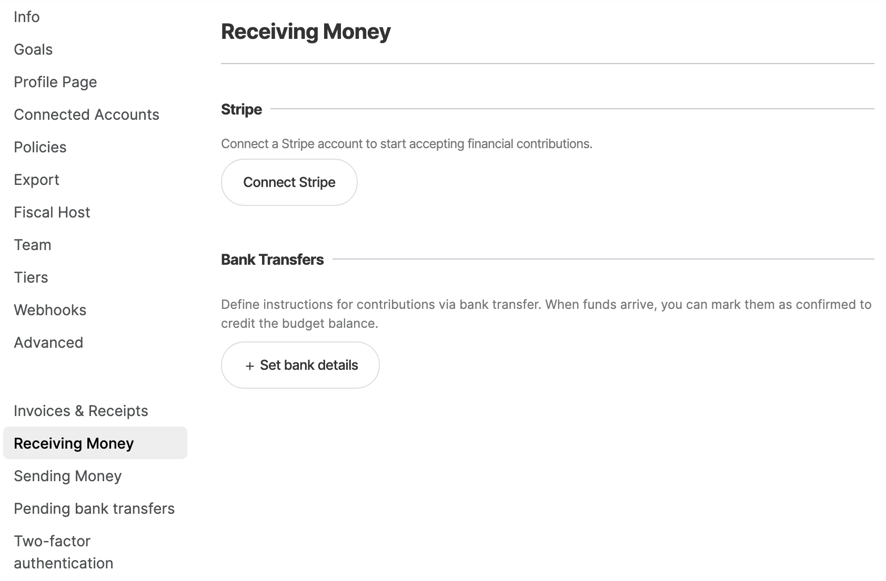

# Independent Collective Setup

Now your Independent Collective has been created. At this point some extra options will have appeared in your settings menu.

### Legal name

If the name of your Collective is not the same as the name of the owner of the bank account holding its funds (person or company), you should specify that owner's name in the legal name field. You can do this in the Info section. 

For example, the Collective may be named for a specific project, but the holder of the funds might be a person or company associated with the project that has another name.

The display name is shown publicly, and the legal name appears on receipts, invoices, and other places where the legal holder of the funds should be used.

### Address

In the Info section, you'll see a field for 'address'. This is used on receipts and invoices, and should be the address of the owner of the bank account where the Collective's funds are held.

### Receiving money

To enable people to contribute to your Collective, you need to set up ways that they can pay you. On this screen you can connect your Stripe account for credit card payments and/or add the details for bank transfers.

If you wish to receive money via PayPal, please [contact support](mailto:support@opencollective.com) as this feature is still in beta.
