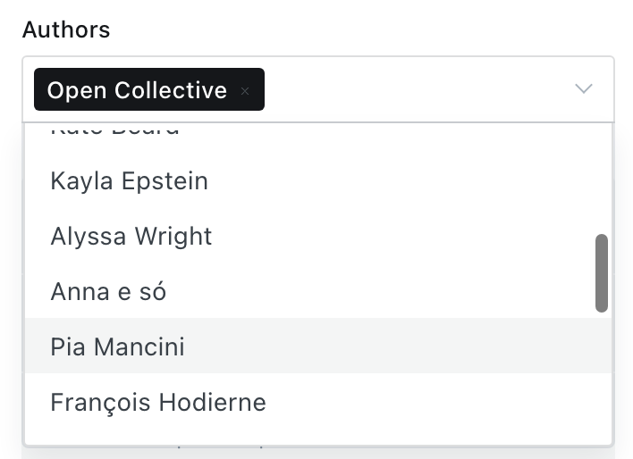
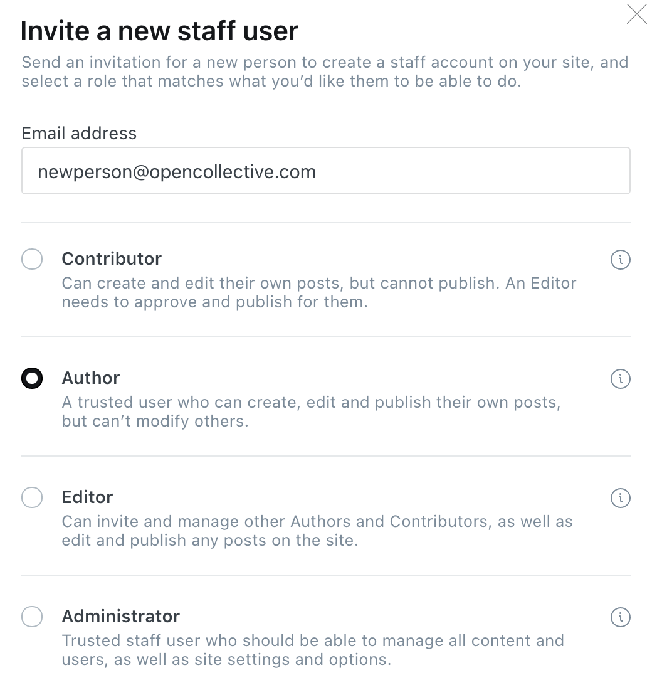
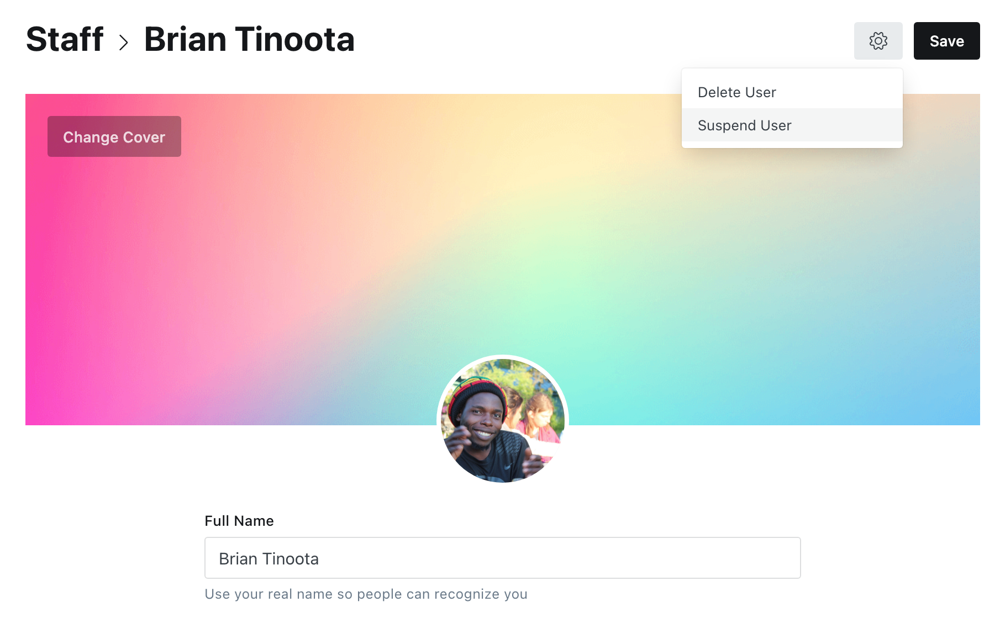
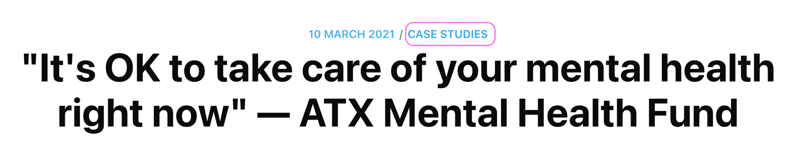
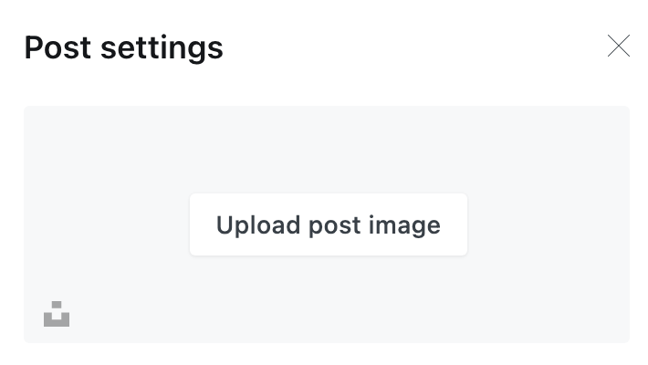

# Blog

The Open Collective blog lives at [https://blog.opencollective.com](https://blog.opencollective.com).

## Using Ghost

Open Collective uses [Ghost](https://ghost.org/), an open source blogging platform. Reach our Ghost dashboard here: [https://opencollective.ghost.io](https://opencollective.ghost.io/ghost/#/site). 

#### Logins and accounts

We use one single team account to log in \(credentials in 1Password\).

When writing a blog post, the author will default to this generic shared usr account \(called Open Collective\). To set yourself or someone else as the author, select them in the 'authors' dropdown in post settings, then delete the 'Open Collective' author.

To create a new author profile, go to the Staff settings and click 'invite people'. Put in their email and set their permissions to 'author'.

The new person will receive an invitation, and they'll be able to click through and set up their photo and bio.

Once they are set up on Ghost, go to the Staff settings, click on their name, then click the gear and select 'suspend user'. This way, we will not be charged extra for their account, but they will be selectable as an author of posts.

## Publishing guidelines

#### Content

In terms of content, anything related to Open Collective or Hosts and Collectives on the platform is welcome.

#### Authorship

Select a human author for posts where possible. Otherwise the group authors can be used \(Open Source Collective, Open Collective Foundation, etc\).

#### Tags

All posts must have at least one tag, and ideally at least one of the top-level tags linked in the blog nav bar: Case Studies, News, or How-to. This top-level tag should be the first tag, so that it shows up next to the date in the header. 

Tags are also used for external direct links to that collection of posts, e.g. the OSC website links to posts tagged "osc" \([https://blog.opencollective.com/tag/osc/](https://blog.opencollective.com/tag/osc/)\), so it can be useful to add multiple tags besides the top-level ones.

#### Post image

All posts must have an image, otherwise they look out of place on the blog homepage and also lack an image preview when shared on social media. Whether you have an image in the blog post itself or not, go into post settings and upload a post image every time.

#### URLs

Pay attention to the URL in post settings before publishing. If you've set a title and later changed it, the auto-generated URL will be from the original title. Often, auto-generated URLs are long and unwieldy, so edit it to something simple and descriptive. E.g. the post titled "Supporting an Ethereum ecosystem with the OASIS Baseline Protocol" has a URL of simply [https://blog.opencollective.com/baseline-protocol](https://blog.opencollective.com/baseline-protocol/).

#### Titles

We aren't trying to create clickbait, but choose titles that are likely to catch a reader's attention, and keep them succinct and to the point. Pick out the most important part of the message and make it the title. Titles should not have a full stop at the end.

#### Sub-headings

The first line after the title is what will get pulled through as the description on social media links, and is the first chance to draw in the reader. It's great if the title and sub-heading can together tell a mini-story that will invite people to click through and learn more.

## Scheduling

In general, we try to space posts out a little, so that we don't have a bunch in one week and then none for a couple weeks. The platform newsletter goes out in the middle of each month, so that's one scheduling consideration. However, we don't follow a strict publishing schedule.

## Blog Bounties

We have a standing offer of $100  for guest posts from any Collective, Host, or other platform user to tell their story of using Open Collective. The $100 bounty is donated to their Collective upon publication \(after review and editing by an OC core staff member\).

